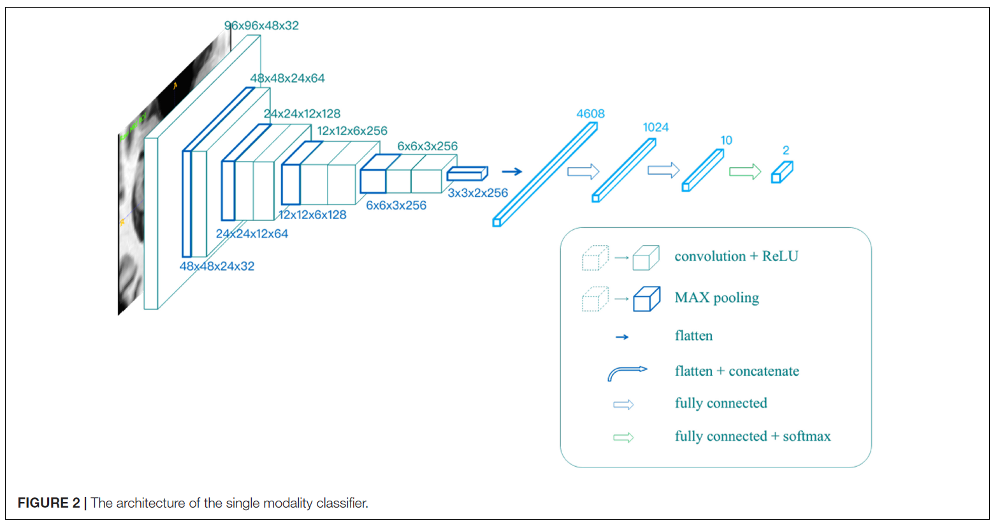

# Diagnosis of Alzheimer’s Disease via Multi-Modality 3D Convolutional Neural Network

This project is the code for the paper *Diagnosis of Alzheimer’s Disease via Multi-Modality 3D Convolutional Neural Network*, by Yechong Huang (me), Jiahang Xu, Yuncheng Zhou, Tong Tong, Xiahai Zhuang (corresponding author) and the ADNI.





For more information, refer to https://www.frontiersin.org/articles/10.3389/fnins.2019.00509/full 

```
AUTHOR=Huang Yechong, Xu Jiahang, Zhou Yuncheng, Tong Tong, Zhuang Xiahai,  the Alzheimer’s Disease Neuroimaging Initiative (ADNI)
	 
TITLE=Diagnosis of Alzheimer’s Disease via Multi-Modality 3D Convolutional Neural Network  
	
JOURNAL=Frontiers in Neuroscience     
		
URL=https://www.frontiersin.org/article/10.3389/fnins.2019.00509     
	  
DOI=10.3389/fnins.2019.00509    
	
ISSN=1662-453X
```

The initial codes were written in tensorflow, and multi-modality networks were re-written in torch.
